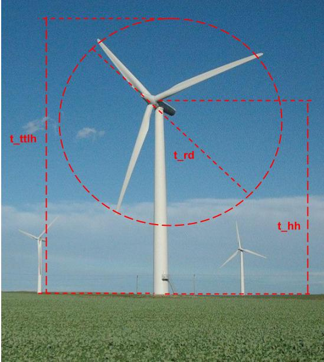
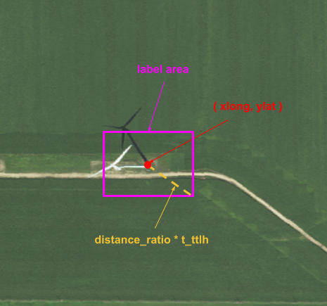

# Wind Turbine Detection in Aerial Photos

##Overview

Welcome to the Wind Turbine Detection project, a robust solution for automatically identifying and locating wind turbines in aerial photographs. This open-source project combines the power of deep learning and computer vision to revolutionize the way we extract valuable information from vast landscapes.

## USAGE

The development and the usage of the git  is described in the notebooks available in the notebooks folder. Further the model is industrialized using the kedro framework, please see the KEDRO section below.

## Data preparation and labeling

Two data sources are used to train the model. The US wind turbine dataset with turbine coordinates and Aerial photos from NAIP. The author develped a script that automatically create boxes for the images labelling. More details follows and code is described in the [data preparation notebook]('./notebooks/Data preparation and labeling.ipynb').

### US wind turbine database 

The dataset available at https://eerscmap.usgs.gov/uswtdb/ is a comprehensive resource that provides detailed information on wind farms and individual turbines locations across the United States. It includes precise coordinates for each turbine, as well as additional data pertaining to turbine geometry, models, and power specifications. This dataset is thoroughly described in the following publication:

[1] Hoen, B.D., Diffendorfer, J.E., Rand, J.T., Kramer, L.A., Garrity, C.P., and Hunt, H.E., 2018, United States Wind Turbine Database v5.1 (July 29, 2022): U.S. Geological Survey, American Clean Power Association, and Lawrence Berkeley National Laboratory data release, available at https://doi.org/10.5066/F7TX3DN0.

For a comprehensive understanding of the dataset's column descriptions and attributes, you can refer to the API Documentation, which can be found at https://eerscmap.usgs.gov/uswtdb/api-doc/. To enhance the convenience of data analysis, the column types and their respective descriptions are provided below for reference.

| Column name | Value Type | Description |
| :-- | :-- | :-- |
| case_id 	| number (integer) 	| Unique stable identification number.|
| faa_ors 	| string 	| Unique identifier for cross-reference to the Federal Aviation Administration (FAA) digital obstacle files.|
| faa_asn 	| string 	|Unique identifier for cross-reference to the FAA obstruction evaluation airport airspace analysis dataset.|
| usgs_pr_id 	| number (integer) 	| Unique identifier for cross-reference to the 2014 USGS turbine dataset.|
| t_state 	| string 	| State where turbine is located.|
| t_county 	| string 	| County where turbine is located.|
| t_fips 	| string 	| State and county fips where turbine is located, based on spatial join of turbine points with US state and county.|
| p_name 	|string 	| Name of the wind power project that the turbine is a part of. Project names are typically provided by the developer; some names are identified via other internet resources, and others are created by the authors to differentiate them from previous projects. Values are that were unknown were assigned a name based on the county where the turbine is located.|
| p_year 	| number (integer) 	| Year that the turbine became operational and began providing power. Note this may differ from the year that construction began.|
| p_tnum 	| number (integer) 	| Number of turbines in the wind power project.|
| p_cap 	| number (float) 	| Cumulative capacity of all turbines in the wind power project in megawatts (MW).|
| t_manu 	| string 	| Turbine manufacturer - name of the original equipment manufacturer of the turbine.|
| t_model 	| string 	| Turbine model - manufacturer's model name of each turbine.|
| t_cap 	| number (integer) 	| Turbine rated capacity - stated output power at rated wind speed from manufacturer, ACP, and/or internet resources in kilowatts (kW).|
| t_hh 	| number (float) 	| Turbine hub height in meters (m).|
| t_rd 	| number (float) 	| Turbine rotor diameter in meters (m).|
| t_rsa 	| number (float) 	| Turbine rotor swept area in square meters (m2).|
| t_ttlh 	| number (float) 	| Turbine total height from ground to tip of a blade at its apex in meters (m).|
| retrofit 	| number (integer) 	| Indicator of whether the turbine has been partially retrofit after initial construction (e.g., rotor and/or nacelle replacement). 0 indicates no known retrofit. 1 indicates yes known retrofit.|
| retrofit_year 	| number (integer) 	| Year in which the turbine was partially retrofit.|
| t_conf_atr 	| number (integer) 	| Level of confidence in the turbine attributes. 1—No confidence: no attribute data beyond total height and year, 2—Partial confidence: incomplete information or substantial conflict between, 3—Full confidence: complete information, consistent across multiple data sources.|
| t_conf_loc 	| number (integer) 	| Level of confidence in turbine location. 1— No turbine shown in image; image has clouds; imagery older than turbine built date, 2— Partial confidence: image shows a developed pad with concrete base and/or turbine parts on the ground, 3— Full confidence: image shows an installed turbine.|
| t_img_date 	| number (integer) 	| Date of image used to visually verify turbine location. Note if source of image is NAIP, the month and day were set to 01/01.|
| t_img_srce 	| string 	| Source of image used to visually verify turbine location.|
| xlong 	| number (float) 	| Longitude of the turbine point, in decimal degrees.|
| ylat 	| number (float) 	| Latitude of the turbine point, in decimal degrees.|
| eia_id 	| number (integer) 	| Plant ID from Energy Information Administration (EIA).|



<p style='text-align: center;'>FIGURE 1 - Wind turbine geometry in the US wind turbine database <br>Photo by Tom Corser www.tomcorser.com, edited by Francesco Paraggio <a href="https://creativecommons.org/licenses/by-sa/3.0">CC BY-SA 3.0</a>, via Wikimedia Commons </p>


From the dataset, we opt to load only the pertinent columns and filter turbines with a __high degree of certainty in both their attributes and geographical location.__ More than 60k records are still available.

Subsequently, the **dataframe is enriched by incorporating turbine coordinates as geometry, transforming it into a GeoDataFrame**. This augmentation enables the execution of spatial analyses and queries, expanding the dataset's utility for geographic investigations.

### Aerial photos labeling

The images used to train our model are obtained from the __Power Plant Satellite Imagery Dataset__, which contains high-resolution (1m) aerial photos from the USDA National Agriculture Imagery Program (NAIP). These images are accessible via the Duke Energy Initiative at https://figshare.com/articles/dataset/Power_Plant_Satellite_Imagery_Dataset/5307364.

These images are equipped with important geographical information, allowing us to pinpoint their location and perform spatial analyses. In our process, __we query the spatialized US database to examine each image and identify if there is any turbine from the db. For each detected turbine, we create a label by generating a buffer zone around the turbine's coordinates. To train our model, we transform these buffer zones' geographical coordinates into pixel coordinates within the images.__



<p style='text-align: center;'>FIGURE 2 - label_naip_images example box<br> Photo from the Power Plant Satellite Imagery Dataset, edited by Francesco Paraggio </p>

Currently, we set the buffer size at 0.6 times the total height of the turbines. However, we acknowledge that for a more precise assessment, it's important to consider additional factors, such as the tilt and height of the aerial photos. You can find more insights on this topic at https://gis.depaul.edu/shwang/teaching/geog258/lec7.htm.

In an ideal scenario, our assessment would encompass not only factors like hub height and total turbine height but also the perspective distortion caused by the height and angle of the viewing point. Unfortunately, the metadata in the image files does not provide this information. However, it may be available through the NAIP resources, as outlined in their documentation at https://www.fsa.usda.gov/Internet/FSA_File/naip_best_practice.pdf.

TODO. satellite data labeling and training


## Model 
The model chosen for object detection is the faster r-cnn. Model definition and data loader classes are in the notebook [model training]('./notebooks/Model training.ipynb').

### Faster R-CNN 

The Faster R-CNN object detection system consists of two modules: a Region Proposal Network (RPN) and the Fast R-CNN detector. The RPN proposes regions, guiding the Fast R-CNN on where to look. The network shares convolutional layers for efficient computation. The RPN uses a fully convolutional network to generate region proposals by sliding over the feature map. It predicts multiple region proposals simultaneously, each associated with an objectness score. The method ensures translation invariance for anchors and functions, reducing the model size. 

In details these are the blocks in the imported architecture:

#### Transform (GeneralizedRCNNTransform) 
This part of the model is responsible for preprocessing the input images. It includes normalization of pixel values and resizing the images to a specific size.

#### Backbone (BackboneWithFPN):
The backbone is the main feature extraction network. It's a deep neural network that takes in the preprocessed image and extracts hierarchical features. In this case, it's a ResNet-based backbone with a feature pyramid network (FPN) added on top.
- _ResNet Backbone:_ [Residual Network](https://en.wikipedia.org/wiki/Residual_neural_network)  is a type of neural network architecture that addresses the vanishing gradient problem in deep networks. It consists of multiple blocks, and each block has residual connections.
- _FPN [Feature Pyramid Network](https://arxiv.org/pdf/1612.03144.pdf) (FeaturePyramidNetwork):_ FPN enhances the backbone network by adding a top-down architecture with lateral connections to build a feature pyramid from the high-level semantic features.    he method is fully convolutional, taking a single-scale image and producing proportionally sized feature maps. The pyramid construction involves a bottom-up pathway using the backbone and a top-down pathway hallucinating higher resolution features, and lateral connections enhancing and merging features. The resulting pyramid shares classifiers and regressors, maintaining a consistent feature dimension. 
<br>
<br>
#### Region Proposal Network (RegionProposalNetwork):
This component proposes candidate object regions for further processing. It uses anchor boxes at different scales and aspect ratios to generate region proposals. The RPN predicts whether there is an object in each region (classification) and refines the bounding box coordinates.

#### Region of Interest Heads (RoIHeads):
RoI heads take the region proposals generated by the RPN and perform further processing to classify and refine the bounding boxes.

- _MultiScale RoIAlign:_ It aligns the features within the region of interest at multiple scales, providing more accurate and robust feature extraction.

- _Two MLP Head:_ The box head is a Multi-Layer Perceptron (MLP) that further processes the features from RoIAlign.
    
- _Fast R-CNN Predictor:_ The box predictor is another MLP that produces the final class scores and bounding box coordinates for each region of interest.


### Model training
The dataset is divided in 6 folds for crossvalidation. 
TODO. COmplete this section

## KEDRO PIPELINES FOR DEPLOYMENT

TODO Complete this section

## Overview

This is your new Kedro project, which was generated using `kedro 0.18.14`.

Take a look at the [Kedro documentation](https://docs.kedro.org) to get started.

## Rules and guidelines

In order to get the best out of the template:

* Don't remove any lines from the `.gitignore` file we provide
* Make sure your results can be reproduced by following a data engineering convention
* Don't commit data to your repository
* Don't commit any credentials or your local configuration to your repository. Keep all your credentials and local configuration in `conf/local/`

## How to install dependencies

Declare any dependencies in `src/requirements.txt` for `pip` installation and `src/environment.yml` for `conda` installation.

To install them, run:

```
pip install -r src/requirements.txt
```

## How to run your Kedro pipeline

You can run your Kedro project with:

```
kedro run
```

## How to test your Kedro project

Have a look at the file `src/tests/test_run.py` for instructions on how to write your tests. You can run your tests as follows:

```
kedro test
```

To configure the coverage threshold, go to the `.coveragerc` file.

## Project dependencies

To generate or update the dependency requirements for your project:

```
kedro build-reqs
```

This will `pip-compile` the contents of `src/requirements.txt` into a new file `src/requirements.lock`. You can see the output of the resolution by opening `src/requirements.lock`.

After this, if you'd like to update your project requirements, please update `src/requirements.txt` and re-run `kedro build-reqs`.

[Further information about project dependencies](https://docs.kedro.org/en/stable/kedro_project_setup/dependencies.html#project-specific-dependencies)

## How to work with Kedro and notebooks

> Note: Using `kedro jupyter` or `kedro ipython` to run your notebook provides these variables in scope: `context`, `catalog`, and `startup_error`.
>
> Jupyter, JupyterLab, and IPython are already included in the project requirements by default, so once you have run `pip install -r src/requirements.txt` you will not need to take any extra steps before you use them.

### Jupyter
To use Jupyter notebooks in your Kedro project, you need to install Jupyter:

```
pip install jupyter
```

After installing Jupyter, you can start a local notebook server:

```
kedro jupyter notebook
```

### JupyterLab
To use JupyterLab, you need to install it:

```
pip install jupyterlab
```

You can also start JupyterLab:

```
kedro jupyter lab
```

### IPython
And if you want to run an IPython session:

```
kedro ipython
```

### How to convert notebook cells to nodes in a Kedro project
You can move notebook code over into a Kedro project structure using a mixture of [cell tagging](https://jupyter-notebook.readthedocs.io/en/stable/changelog.html#release-5-0-0) and Kedro CLI commands.

By adding the `node` tag to a cell and running the command below, the cell's source code will be copied over to a Python file within `src/<package_name>/nodes/`:

```
kedro jupyter convert <filepath_to_my_notebook>
```
> *Note:* The name of the Python file matches the name of the original notebook.

Alternatively, you may want to transform all your notebooks in one go. Run the following command to convert all notebook files found in the project root directory and under any of its sub-folders:

```
kedro jupyter convert --all
```

### How to ignore notebook output cells in `git`
To automatically strip out all output cell contents before committing to `git`, you can run `kedro activate-nbstripout`. This will add a hook in `.git/config` which will run `nbstripout` before anything is committed to `git`.

> *Note:* Your output cells will be retained locally.

## Package your Kedro project

[Further information about building project documentation and packaging your project](https://docs.kedro.org/en/stable/tutorial/package_a_project.html)
